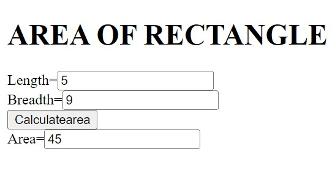

# Design a Website for Server Side Processing

## AIM:
To design a website to perform mathematical calculations in server side.

## DESIGN STEPS:

### Step 1:

Create a new Angular project.

### Step 2:

Inside project create app called mathapp.

### Step 3:

Create a html called area.html

### Step 4:

Do the mathematical part in views.py.

### Step 5:
Give the urls in urls.py.

### Step 6:

Publish the website in the given URL:http://srinivas09.student.saveetha.in/
## PROGRAM :
AREA.HTML:
~~~
<!DOCTYPE html>
<html>
<head>
    <meta charset='utf-8'>
    <meta http-equiv='X-UA-Compatible' content='IE=edge'>
    <title>Page Title</title>
    <meta name='viewport' content='width=device-width, initial-scale=1'>
    <link rel='stylesheet' type='text/css' media='screen' href='main.css'>
</head>
<body>
    <h1>AREA OF RECTANGLE</h1>
    <form method="POST">
        
        Length=<input type='text' name='length' value='{{l}}'></input> 
        Breadth=<input type='text' name='breadth' value='{{b}}'></input> 
        <input type='submit' value='Calculatearea'></input> 
        Area=<input type='text' name='area' value='{{area}}'></input> 
    </form>
</body>
</html>
~~~
views.py:
~~~
from django.shortcuts import render

# Create your views here.
def areacalcution(request):
    context={}
    context['area']='0'
    context['l']='0'
    context['b']='0'
    if request.method == 'POST':
        l=request.POST.get('length','0')
        b=request.POST.get('breadth','0')
        area=int(l)*int(b)
        context['area']=area
        context['l']=l
        context['b']=b
    return render(request,'mathapp/area.html',context)
 ~~~
 urls.py:
 ~~~
from django.contrib import admin
from django.urls import path
from mathapp import views

urlpatterns = [
    path('admin/', admin.site.urls),
    path('areaofrectangle/',views.areacalcution,name='areaofrectangle'),
    path('',views.areacalcution,name='areaofrectangleroot')
]
~~~

## OUTPUT:

### Home Page:

## Result:
Therefor the above codes are successfully executed to run server side programming and mathematical calcualtions.
